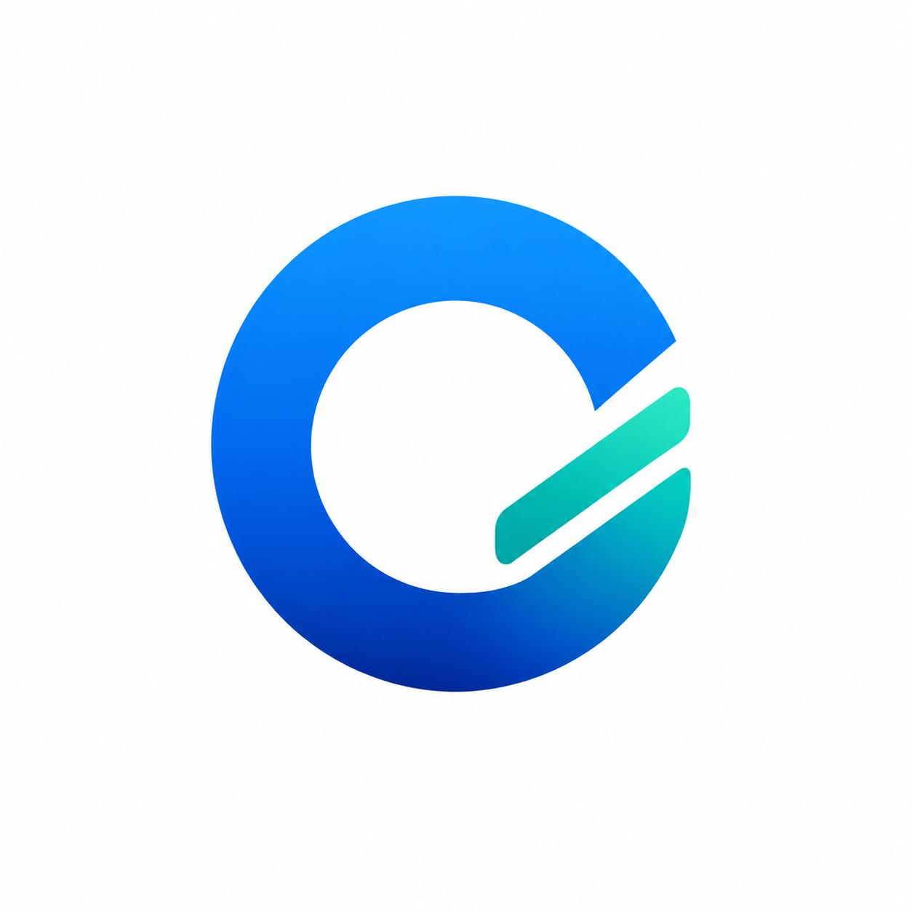

<p align="center">
  
</p>

<h1 align="center">Okanemo</h1>

<p align="center">A local-first bookkeeping app for small businesses.</p>

Okanemo helps a small business track purchasing, inventory, sales, and finances in one place — all from the browser, with no backend or account required. Every record you create is stored locally, so your data stays on your own machine.

## Stack

- React 18 (hooks + Context API)
- Vite 5
- Chart.js + react-chartjs-2
- lucide-react

## Getting started

```bash
npm install
npm run dev       # start dev server (http://localhost:5173)
```

## Commands

```bash
npm run dev       # start dev server
npm run build     # production build -> dist/
npm run preview   # preview production build (port 4173)
npm run lint      # eslint (0 warnings allowed)
npm run format    # prettier over src/**/*.{js,jsx,css}
```

## Project structure

```
src/
  App.jsx                    # Root: tab-based navigation, dark mode
  main.jsx                   # Entry point
  context/AppContext.jsx     # Global store: useReducer + localStorage persistence
  hooks/useApp.js            # useContext(AppContext) shorthand
  utils/                     # Constants, formatting/cost math, data migrations
  components/
    Sidebar.jsx, TopBar.jsx
    pages/                   # One file per tab (Dashboard, Sales, Inventory, ...)
    shared/                  # Reusable UI components
```

## Data model

State is split into eight slices — suppliers, reloads, orders, shipments, products, sales, expenses, accounts — each persisted to its own `localStorage` key. Money flows through a five-stage purchasing pipeline: **reload** (convert currency into a wallet) → **order** (purchase against that wallet) → **shipment** (consolidate purchases) → **arrival** (freeze landed cost per unit) → **sale** (FIFO draw from cost batches).

## Backup & restore

Since all data is stored in `localStorage`, it's tied to the browser origin. Use Settings → Backup & Restore to export/import a JSON snapshot when moving data between environments.
